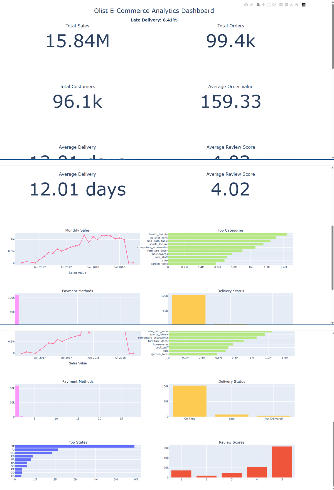

# Olist E-Commerce Data Analysis

## 📊 Project Overview

This project analyzes the Olist Brazilian e-commerce dataset to understand sales performance, customer behavior, product performance, payment methods, seller performance, reviews, and delivery performance.

The project combines multiple datasets and transforms them into an analytical dataset that can be used to generate business insights and KPIs.

---

## 🎯 Business Objectives

The main objectives of this project are:

- Analyze overall sales and order performance
- Identify top-performing product categories
- Understand customer distribution across states
- Analyze payment methods
- Evaluate delivery performance
- Analyze customer review scores
- Identify high-performing sellers and products
- Create an interactive analytics dashboard

---

## 🗂️ Dataset

The project uses the Olist Brazilian E-Commerce dataset.

The analysis uses information from:

- Customers
- Orders
- Order Items
- Products
- Payments
- Reviews
- Sellers
- Geolocation
- Product Category Translation

The raw dataset is not included in this repository.

---

## 🛠️ Technologies Used

- Python
- Pandas
- NumPy
- Matplotlib
- Seaborn
- Plotly
- Jupyter Notebook
- Git & GitHub

---

## 🔄 Data Processing

The following steps were performed:

1. Loaded multiple Olist CSV datasets
2. Inspected dataset structure and data types
3. Checked missing values and duplicates
4. Converted order date columns to datetime format
5. Created delivery-time and delivery-delay features
6. Converted price and freight values to numeric format
7. Translated product categories
8. Aggregated payment information by order
9. Aggregated review information by order
10. Merged the datasets into an analytical dataset
11. Created KPI metrics
12. Performed exploratory data analysis

---

## 📈 Key KPIs

The analysis includes:

- Total Sales
- Total Orders
- Total Customers
- Average Order Value
- Average Delivery Days
- Average Review Score
- Late Delivery Percentage

---

## 📊 Exploratory Data Analysis

The project analyzes:

### Sales Analysis
- Monthly sales trends
- Sales by product category
- Sales by state
- Product sales performance

### Customer Analysis
- Customer distribution by state
- Customer purchasing patterns

### Payment Analysis
- Payment method usage
- Payment value by payment method

### Delivery Analysis
- Average delivery time
- Late deliveries
- Delivery status

### Review Analysis
- Review score distribution
- Relationship between delivery performance and reviews

### Seller Analysis
- Seller sales performance
- Seller order activity

---

## 📊 Interactive Dashboard

An interactive dashboard was created using Plotly.

The dashboard contains:

- KPI cards
- Monthly sales
- Top product categories
- Payment methods
- Delivery status
- Top states
- Review scores
- Late delivery percentage

### Dashboard Preview



The interactive dashboard is available here:

`olist_dashboard.html`

---

## 📁 Project Structure

```text
olist-ecommerce-data-analysis/
│
├── .gitignore
├── README.md
│
├── final.ipynb
├── interactive.ipynb
├── olist_analysis.ipynb
│
├── olist_dashboard.html
├── dashboard_preview.png
├── olist_kpis.csv
└── olist_main_dataset.csv
```
